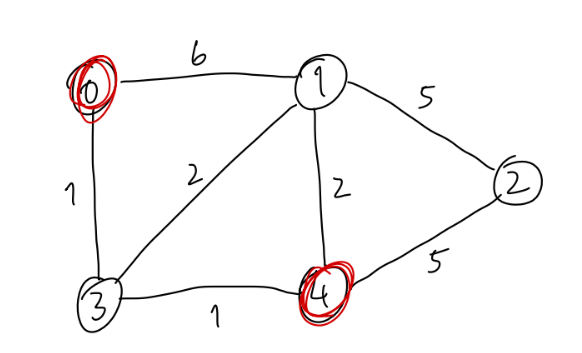
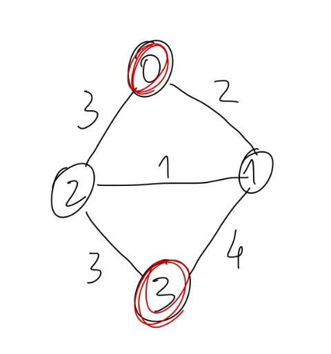
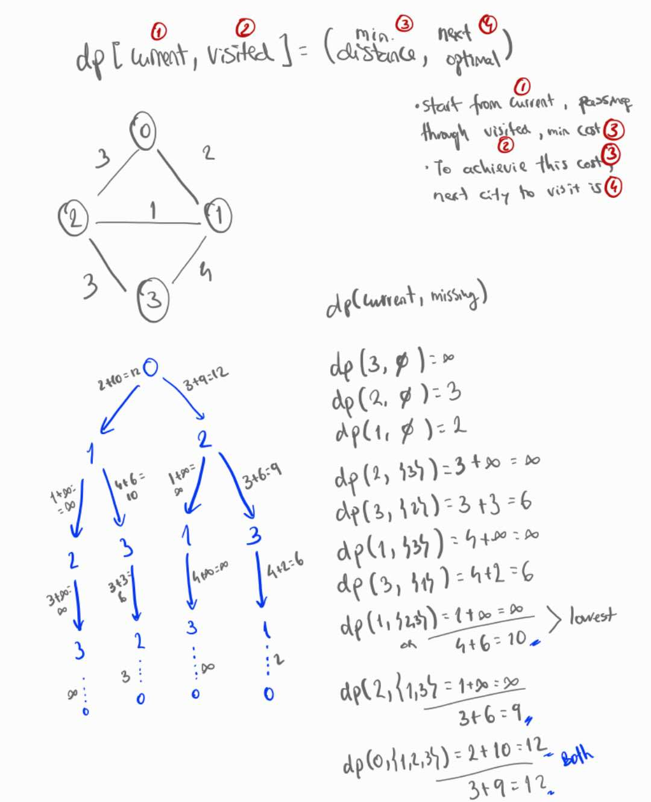

## Shortest Path



```bash
ghci> shortestPath gTest4 "0" "4"
```

```hs
gTest4 :: RoadMap

gTest4 = [ ("0","1",6), ("0","3",1), 
           ("1","2",5),("1","3",2),("1","4",2),
           ("2","4",5),
           ("3","4",1)
         ]
```

```hs
adjList = [ ("0", [("1", 6), ("3", 1)]),
            ("1", [("0", 6), ("2", 5), ("3", 2), ("4", 2)]),
            ("2", [("1", 5), ("4", 5)]),
            ("3", [("0", 1), ("1", 2), ("4", 1)]),
            ("4", [("1", 2), ("2", 5), ("3", 1)])
          ]
```

```bash
start = "0"
goal = "4"
initialQueue = [("0", [], 0)]

Iteration 1:
    City: "0", Path: [], Distance: 0, minDist: INFINITE
    Neighbors: [("1", 6), ("3", 1)]
    Add to Queue: 
        -> ("3", ["0"], 1) - Distance to "3" is 1
        -> ("1", ["0"], 6) - Distance to "1" is 6
    New Queue: [("3", ["0"], 1), ("1", ["0"], 6)]
    Visited: ["0"]

Iteration 2:
    City: "3", Path: ["0"], Distance: 1, minDist: INFINITE
    Neighbors: [("0", 1), ("1", 2), ("4", 1)]
    Add to Queue:
        -> ("4", ["3", "0"], 2) - Distance to "4" through "3" is 2
        -> ("1", ["3", "0"], 3) - Distance to "1" through "3" is 3
    New Queue: [("4", ["3", "0"], 2), ("1", ["3", "0"], 3), ("1", ["0"], 6)]
    Visited: ["0", "3"]

Iteration 3:
    City: "4", Path: ["3", "0"], Distance: 2, minDist: INFINITE
    Goal City Reached with Distance 2
    Update minDist to 2
    Reverse ["4", "3", "0"] to ["0", "3", "4"] and add to Paths
    Paths: [["0", "3", "4"]]

Iteration 4:
    City: "1", Path: ["3", "0"], Distance: 3, minDist: 2
    Distance > minDist, so no shorter path can be found from this point.
    Skip further exploration of this path.
    ...

...

Final Paths

At the end, the shortest paths found are [["0", "3", "4"]] with a minimum distance of 2.
```



```bash
ghci> shortestPath gTest5 "0" "3"
[["0","1","2","3"],["0","2","3"],["0","1","3"]]
```

## Travel Sales
**Each state of gTest5**
```bash
ghci> travelSales gTest5
Current state: (currentCity, visited) = (1,3)
Current min cost: 1000000000
Next city: 2
Total cost: 1000000001
Updated dp entry: ((1,3),Just (1000000001,2))

Current state: (currentCity, visited) = (2,7)
Current min cost: 1000000000
Next city: 3
Total cost: 1000000003
Updated dp entry: ((2,7),Just (1000000003,3))

Current state: (currentCity, visited) = (0,1)
Current min cost: 1000000000
Next city: 1
Total cost: 12
Updated dp entry: ((0,1),Just (12,1))

Current state: (currentCity, visited) = (1,3)
Current min cost: 1000000000
Next city: 3
Total cost: 10
Updated dp entry: ((1,3),Just (10,3))

Current state: (currentCity, visited) = (3,11)
Current min cost: 1000000000
Next city: 2
Total cost: 6
Updated dp entry: ((3,11),Just (6,2))

Current state: (currentCity, visited) = (2,5)
Current min cost: 1000000000
Next city: 1
Total cost: 1000000001
Updated dp entry: ((2,5),Just (1000000001,1))

Current state: (currentCity, visited) = (1,7)
Current min cost: 1000000000
Next city: 3
Total cost: 1000000004
Updated dp entry: ((1,7),Just (1000000004,3))

Current state: (currentCity, visited) = (0,1)
Current min cost: 12
Next city: 2
Total cost: 12
Updated dp entry: ((0,1),Just (12,2))

Current state: (currentCity, visited) = (2,5)
Current min cost: 1000000000
Next city: 3
Total cost: 9
Updated dp entry: ((2,5),Just (9,3))

Current state: (currentCity, visited) = (3,13)
Current min cost: 1000000000
Next city: 1
Total cost: 6
Updated dp entry: ((3,13),Just (6,1))

["0","1","3","2","0"]
```



**Complete memoization table**
```
(current,visited) = (distance,next)
(0,0) = Nothing
(0,1) = Just (12,1)
(0,2) = Nothing
(0,3) = Nothing
(0,4) = Nothing
(0,5) = Nothing
(0,6) = Nothing
(0,7) = Nothing
(0,8) = Nothing
(0,9) = Nothing
(0,10) = Nothing
(0,11) = Nothing
(0,12) = Nothing
(0,13) = Nothing
(0,14) = Nothing
(0,15) = Nothing
(1,0) = Nothing
(1,1) = Nothing
(1,2) = Nothing
(1,3) = Just (10,3)
(1,4) = Nothing
(1,5) = Nothing
(1,6) = Nothing
(1,7) = Nothing
(1,8) = Nothing
(1,9) = Nothing
(1,10) = Nothing
(1,11) = Nothing
(1,12) = Nothing
(1,13) = Nothing
(1,14) = Nothing
(1,15) = Nothing
(2,0) = Nothing
(2,1) = Nothing
(2,2) = Nothing
(2,3) = Nothing
(2,4) = Nothing
(2,5) = Just (9,3)
(2,6) = Nothing
(2,7) = Nothing
(2,8) = Nothing
(2,9) = Nothing
(2,10) = Nothing
(2,11) = Nothing
(2,12) = Nothing
(2,13) = Nothing
(2,14) = Nothing
(2,15) = Nothing
(3,0) = Nothing
(3,1) = Nothing
(3,2) = Nothing
(3,3) = Nothing
(3,4) = Nothing
(3,5) = Nothing
(3,6) = Nothing
(3,7) = Nothing
(3,8) = Nothing
(3,9) = Nothing
(3,10) = Nothing
(3,11) = Just (6,2)
(3,12) = Nothing
(3,13) = Just (6,1)
(3,14) = Nothing
(3,15) = Nothing
```
